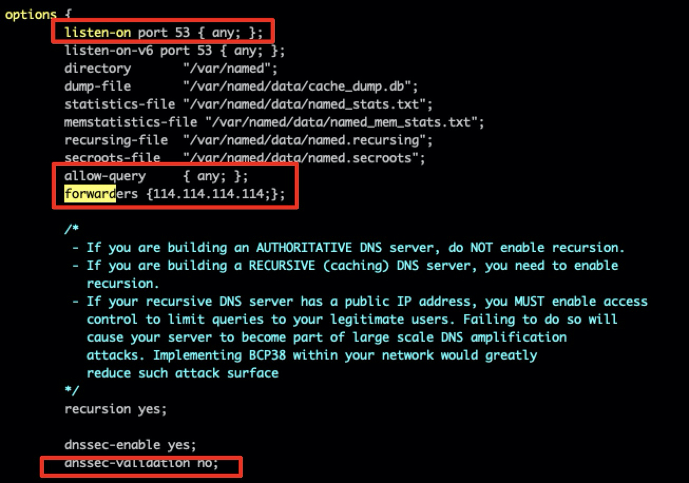
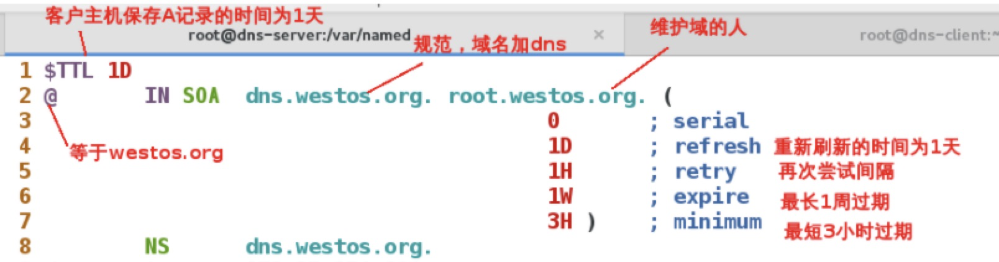

# DNS服务部署

## 一: DNS高速缓存的部署

### 1.安装部署dns

```
systemctl stop firewalld
关闭selinux
yum install bind.x86_64 -y
systemctl start named				##动虚拟机鼠标键盘可以加速		
systemctl enable named.service
```

### 2.高速缓存dns

```
 vim /etc/named.conf 		
写入或更改：
 11 li sten-on port 53 { any; };   打开接口
 17 allow-query     { any; };    允许所有查询
 18 forwarders {114.114.114.114;};  权威dns服务器
 33 dnssec-validation no;
 
 systemctl restart named
```




### 3.测试

在客户机做解析

```
cat /etc/resolv.conf
   nameserver 192.168.56.108  服务器的ip

dig www.baidu.com
```

测试结果如下:


## 二. 权威DNS正向解析

### 1.配置文件

编辑dns服务主配置文件：

```
写入或更改：
 11 listen-on port 53 { any; };
 17 allow-query     { any; };
 18 forwarders {114.114.114.114;};
 33 dnssec-validation no;
```

编辑dns服务子配置文件：

```
vim /etc/named.rfc1912.zones
增加
zone "westos.org" IN {               #维护域名
         type master;
         file "westos.org.zone";     #域名信息保存目录
         allow-update { none; };
 };
```

### 2.建立域名信息文件

dns服务的数据发布目录为`/var/named/`，因此需要在此目录下建立：

```
cd /var/named/
cp -p named.localhost westos.org.zone
vim westos.org.zone
$TTL 1D
@	IN SOA	 dns.westos.org.    root.westos.org. (
					0	; serial
					1D	; refresh
					1H	; retry
					1W	; expire
					3H )	; minimum
	NS      dns.westos.org.
dns	A	192.168.56.108
www	A       192.168.56.109
```

其中信息含义为：



### 3.测试

在客户主机做解析：

```
 cat /etc/resolv.conf
# Generated by NetworkManager
#nameserver 8.8.8.8
nameserver 192.168.56.108
dig www.westos.org
```


### 4.dns名称转化和轮循

客户在访问规范域名时转换为内部的域名：

```
cat /var/named/westos.org.zone
$TTL 1D
@	IN SOA	 dns.westos.org.    root.westos.org. (
					0	; serial
					1D	; refresh
					1H	; retry
					1W	; expire
					3H )	; minimum
	NS      dns.westos.org.
dns	   A	          192.168.56.108
www	  CNAME         bbs.westos.org.
bbs     A           192.168.56.109
bbs     A           192.168.56.105
```

填入以上内容即可实现地址的轮询，使用`dig`命令访问`www.westos.org`（将转换为`bbs.westos.org`）或者`bbs.westos.org`时将会在`192.168.56.109`和192.168.56.105中轮询：


## 三.DNS反向解析

`dig`命令加参数`-x`可以实现ip的反向解析

### 1.编辑服务子配置文件

```
vim /etc/named.rfc1912.zones
zone "56.168.192.in-addr.arpa" IN {     #解析网段
          type master;
          file "westos.org.ptr";        #反向解析文件
          allow-update { none; };
  };

```

### 2.建立反向解析文件

在服务数据发布目录重建立文件：

```
 cd /var/named/
 cp -p named.loopback westos.org.ptr
 vim westos.org.ptr
 bbs.westos.org. :反向解析ip对应的域名
 PTR    表示反向解析
 109/104  表示解析的ip
```


### 3.测试

```
在客户端
dig -x 192.168.56.109
```


[原文](https://blog.csdn.net/qq_35887546/article/details/103264920)

